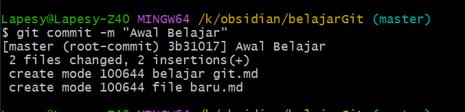

# 1.Instalasi Git Bash
Git Bash adalah antarmuka baris perintah (command line interface) yang digunakan untuk berinteraksi dengan Git di lingkungan Windows. Git Bash mengemulasikan lingkungan terminal Unix, menyediakan perintah-perintah Unix yang biasa ditemukan pada sistem operasi Linux atau MacOS, sehingga memudahkan pengguna yang terbiasa dengan lingkungan tersebut.

Untuk melakukan instalasi **Git Bash** terlebih dahulu download Git Bash pada web ini
Link **Git Bash** : <https://git-scm.com/>


setelah masuk kedalam website **Git SCM** klik tombol *"Download for windows"*


Setelah mendowload silahkan lakukan instalasi aplikasi


# 2.Pembuatan Akun Github
GitHub adalah platform hosting untuk pengembangan perangkat lunak yang menggunakan sistem version control Git. GitHub menyediakan layanan berbasis web untuk repositori Git serta fitur tambahan seperti pelacakan bug, manajemen tugas, dan kolaborasi.

Buka Github melalui Web Browser (chrome,firefox,safari,bing)
Link Github : <https://github.com/>


Klik tombol **Signin** pada bagian kanan atas


Masukan **"Username or email address and password** dan klik tombol *"Signin"*


Tampilan akan seperti diatas jika login Github berhasil

# 3.Membuat Repository
***[[Langkah pertama]]***
Masuk ke dalam github pada web browser (chrome,bing,firefox,safari dll)
Link github : 
[[https://github.com/]]

Gambar 0.1


***[[Langkah kedua]]***
klik pada bagian avatar dan klik ***"Your Repository"***

Gambar 0.2


***[[Langkah 3]]***
klik tombol ***"New***" yang berwarna hijau

Gambar 0.3
]]

***[[Langkah 4]]***
masukan ***"Repository Name"**** dan Klik tombol ***"Create Repository"*** berwarna hijau

Gambar 0.4


***[[Langkah Terakhir]]***
selesai sudah pembuatan ***"New Repository"*** Dalam Github

Gambar 0.5


# 4.Konfigurasi Awal di Git Bash
code 2.1
```shell
git config --list
```
Penjelasan:
perintah yang digunakan di terminal atau command line untuk menampilkan semua konfigurasi yang sedang berlaku untuk Git di sistem

Gambar 2.1


code 3.1
```shell
git config --global user.name "Nama Username Github"
=======================================================
git config --global user.name "clementhermawan"
```
 Penjelasan:
 perintah yang digunakan di terminal atau command line untuk mengatur nama pengguna Git di tingkat global.

Gambar 3.1


code 3.2
```shell
git config --global user.mail (Nama email github)
=======================================================
git config --global user.mail clementhermawan2021@gmail.com
```
 Penjelasan:
perintah yang digunakan di terminal atau command line untuk mengatur alamat email pengguna Git di tingkat global.

Gambar 3.2


# 5.Akses Folder Proyek di Git Bash
code 5.1
```shell
cd K:/obsidian
cd belajarGit/
```
Penjelasan: 
perintah yang digunakan di terminal atau command line untuk mengubah direktori kerja saat ini.

Gambar 5.1


# 6.Hubungkan Folder Proyek Lokal Ke Github
code 1.1
```bash
git --version
```
Penjelasan : 
perintah yang digunakan di terminal atau command line untuk menampilkan versi dari program Git yang terinstal pada sistem

Gambar 1.1


code 2.1
```shell
git config --list
```
Penjelasan:
perintah yang digunakan di terminal atau command line untuk menampilkan semua konfigurasi yang sedang berlaku untuk Git di sistem

Gambar 2.1


code 3.1
```shell
git config --global user.name "Nama Username Github"
=======================================================
git config --global user.name "clementhermawan"
```
 Penjelasan:
 perintah yang digunakan di terminal atau command line untuk mengatur nama pengguna Git di tingkat global.

Gambar 3.1


code 3.2
```shell
git config --global user.mail (Nama email github)
=======================================================
git config --global user.mail clementhermawan2021@gmail.com
```
 Penjelasan:
perintah yang digunakan di terminal atau command line untuk mengatur alamat email pengguna Git di tingkat global.

Gambar 3.2
]]

code 4.1
```shell
pwd
```
Penjelasan: 
perintah yang digunakan di terminal atau command line untuk menampilkan direktori kerja saat ini.

Gambar 4.1


code 5.1
```shell
cd K:/obsidian
cd belajarGit/
```
Penjelasan: 
perintah yang digunakan di terminal atau command line untuk mengubah direktori kerja saat ini.

Gambar 5.1


code 6.1
```shell
ls
```
Penjelasan : 
perintah yang digunakan di terminal atau command line untuk menampilkan daftar file dan direktori di dalam direktori kerja saat ini.

Gambar 6.1


code 7.1
```shell
git init
```
Penjelasan : 
perintah yang digunakan di terminal atau command line untuk menginisialisasi sebuah repositori Git baru dalam direktori saat ini.

Gambar 7.1


code 7.2
```shell
git remote add origin "link repository github"
=================================================
git remote add origin https://github.com/clementhermawan/Belajar_git.git
```
Penjelasan:
perintah yang digunakan di terminal atau command line untuk menambahkan remote repository ke repositori Git lokal

Gambar 7.2


code 7.3
```shell
git add.
```
Penjelasan: 
perintah yang digunakan di terminal atau command line untuk menambahkan semua file dan perubahan di direktori kerja saat ini ke staging area di Git.

Gambar 7.3


code 7.4
```shell
git commit -m "Awal belajar"
```
Penjelasan: 
perintah yang digunakan di terminal atau command line untuk membuat commit baru dalam repositori Git.

Gambar 7.4


code 7.5
```shell
git push origin master 
```
Penjelasan: 
perintah yang digunakan di terminal atau command line untuk mengirimkan commit dari repositori Git lokal Anda ke remote repository di server (seperti GitHub) pada cabang tertentu.

Gambar 7.5


# 7.Update File Dari Git ke Github
code 8.1
```shell
git add .
```
Penjelasan: 
perintah yang digunakan di terminal atau command line untuk menambahkan semua file dan perubahan di direktori kerja saat ini ke staging area di Git.

Gambar 8.1


code 8.2
```shell
git commit -m "Awal Belajar 2"
```
Penjelasan: 
perintah yang digunakan di terminal atau command line untuk membuat commit baru dalam repositori Git.

Gambar 8.2


code 8.3
```shell
git push origin master
```
Penjelasan: 
perintah yang digunakan di terminal atau command line untuk mengirimkan commit dari repositori Git lokal Anda ke remote repository di server (seperti GitHub) pada cabang tertentu.

Gambar 8.3


Gambar 8.4 (Sebelum terupdate)


Gambar 8.5(Sesudah diupdate)


